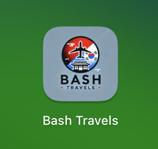

# **Bash Travels ✈️ – AI-Powered Travel Companion**

[](https://youtu.be/rpbylbmUmYM)

*A full-stack web app designed to simplify travel planning for Japan & Korea.*

<p align="center">
  
  
</p>

---

## **🌍 About the Project**

Bash Travels is a one-stop solution for planning trips, offering AI-powered recommendations, real-time translations, and essential travel tools. Built specifically for a trip to **Japan & Korea**, this app combines everything needed into a single, easy-to-use platform.

---

## **⚙️ Features**

✅ **AI-Powered Assistant** – Get real-time travel recommendations, find **nearby restrooms**, and translate on the go.  
✅ **Pocket Translator** – Quick English-to-Japanese/Korean translations with phonetic support.  
✅ **Itinerary Planner** – Pre-built and customizable travel plans for each day.  
✅ **Currency Converter** – Simple USD, JPY, and KRW conversions.  
✅ **Location-Based Search** – Instantly find **restaurants, stores, and emergency locations** nearby using OpenStreetMap.  

---

## **🛠️ Tech Stack**

- **Frontend:** HTML, CSS, JavaScript, Bootstrap  
- **Backend:** Node.js, Express.js  
- **AI Integration:** OpenAI API (GPT)  
- **Location Data:** OpenStreetMap Overpass API  
- **Database:** Supabase  
- **Hosting:** Vercel (Frontend & Backend)

---

## **🗂️ Architecture Flowchart**

```
[User Interaction]
       |
       v
[Website Frontend] (Deployed on Vercel)
       |
       v
[Main.js]
   |               \
   v                v
[Supabase Handler]   [OpenAI API]
   |                /
   v               /
[Supabase Database]    (Data Stored)
       |
       v
[Serverless Endpoint (Vercel API Routes)]
   |
   v
[Supabase + OpenAI Keys stored securely in Vercel Environment Variables]
```

---

## **🖥️ Getting Started**

### **1⃣ Clone the Repository**

```sh
git clone https://github.com/YOUR_GITHUB_USERNAME/bash-travels.git
cd bash-travels
```

### **2⃣ Install Dependencies**

#### Frontend:

```sh
cd frontend
npm install
```

#### Backend:

```sh
cd backend
npm install
```

### **3⃣ Set Up Environment Variables**

Create a `.env` file inside `backend/` and add:

```sh
OPENAI_API_KEY=your_openai_api_key_here
SUPABASE_URL=your_supabase_url_here
SUPABASE_KEY=your_supabase_key_here
```

### **4⃣ Run the Project Locally**

#### **Start Backend**

```sh
cd backend
node server.js
```

The backend will run on [**http://localhost:5001**](http://localhost:5001)

#### **Start Frontend**

```sh
cd frontend
npm start
```

The frontend will run on [**http://localhost:3000**](http://localhost:3000)

---

## **🌎 Live Demo**

Check out the deployed version:  
🔗 [**Bash Travels Live**](https://bash-travels.vercel.app/)

---

## **🔒 Privacy Policy**

We value your privacy. While no personal data is collected, **questions entered into the AI assistant** are tracked anonymously for the purpose of improving the user experience.  

The data stored in Supabase is limited to:  
- The **questions** users ask  
- A **timestamp** of when the question was entered  

This data is collected anonymously without identifying user details.  

---

## **📉 Future Improvements**

- 🏞️ **Interactive Map for Sightseeing Locations**  
- 🗓️ **User-Customized Itinerary Planner**  
- 🏨 **Hotel & Airbnb Recommendations**  

---

### **🔐 Privacy Policy**
Your privacy is important. While the Bash Travels app tracks user questions for insights and improvements, no personal information such as names, emails, or IP addresses is collected. All data is stored anonymously in Supabase to ensure privacy and security.
